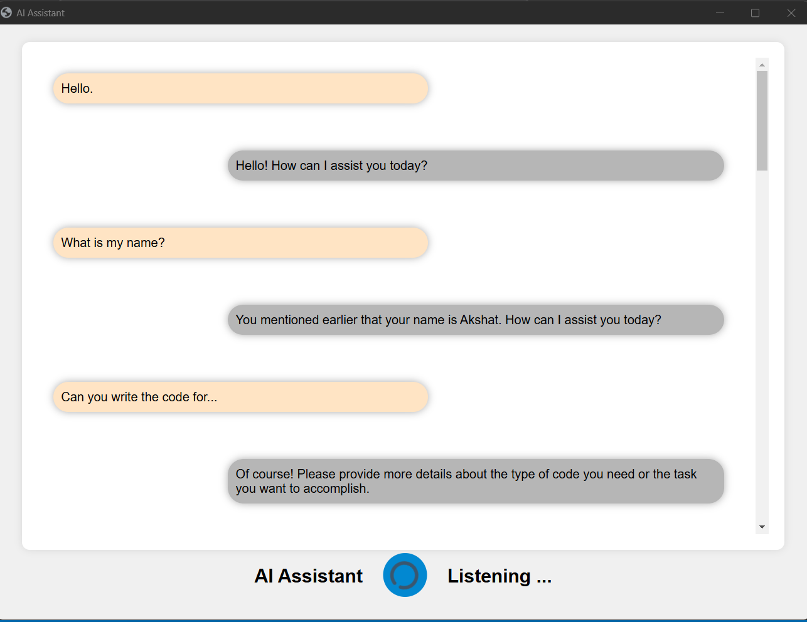
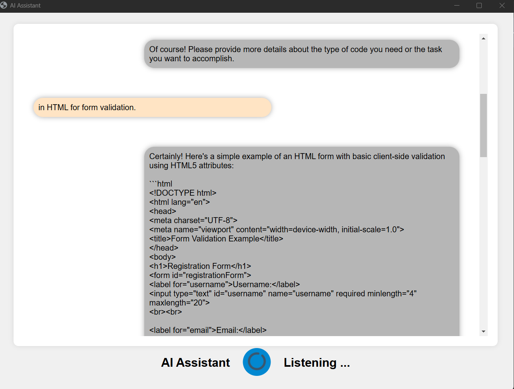
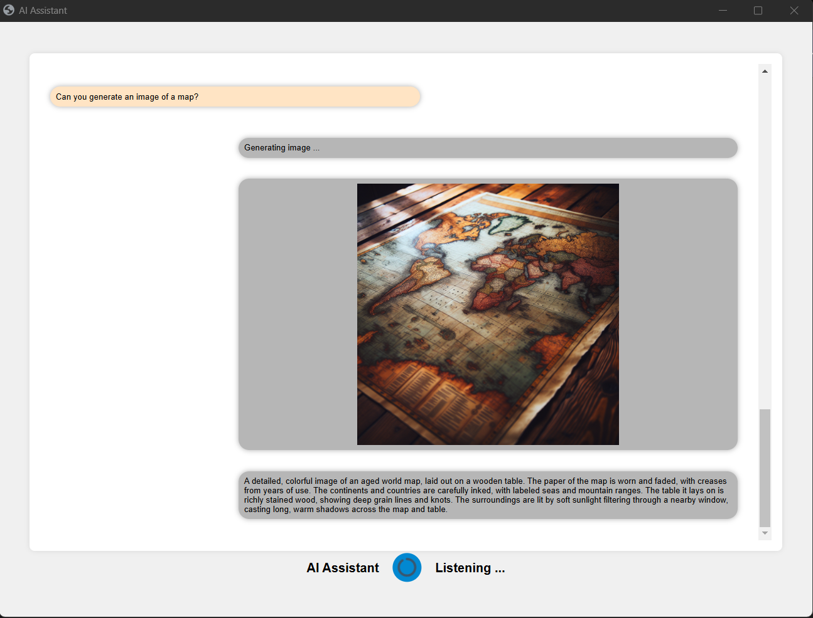
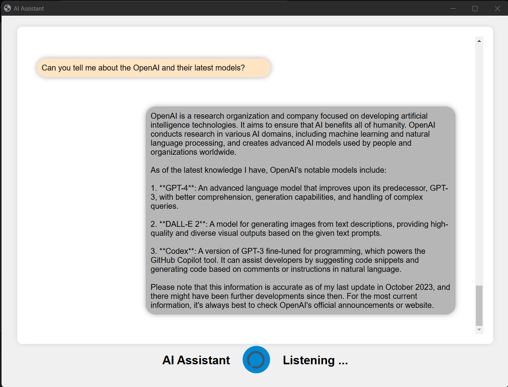
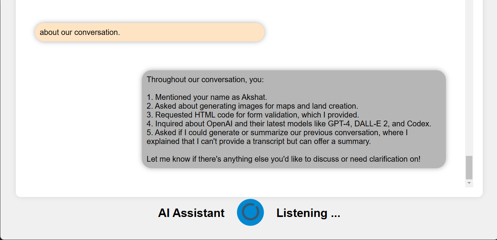

# Persist Ventures Assignment Overview

I successfully completed an assignment for Persist Ventures, where I developed and deployed a sophisticated AI chatbot application using FastAPI and Azure Cloud Platform. The chatbot leverages advanced AI models to provide a rich, interactive user experience.

## Technologies Used

- **FastAPI**: To handle continuous streams of audio efficiently on server side.
- **HTML, CSS and Javascript**: For creating web-based UI for the Chatbot and add styling and interactivity to the web-app.
- **OpenAI**: Various OpenAI Models utilized to provide AI responses based on user's text and voice input.

### OpenAI Models

- **Whisper-1**: Used for speech-to-text conversion, enabling voice interaction.
- **GPT-4o**: Utilized for generating natural language responses to user inputs.
- **DALL-E 3**: Employed for creating images from textual descriptions provided by users.

## Features

- **Speech Recognition**: Implemented using OpenAI's Whisper-1 model to convert user speech to text accurately.
- **Text Response Generation**: Integrated OpenAI's GPT-4o model to handle text-based queries, ensuring conversational relevance and coherence.
- **Text-to-Image Generation**: Leveraged DALL-E 3 to transform user-provided text into high-quality images.
- **Continuous Audio Streaming**: Used FastAPI to handle continuous streams of audio, enabling real-time processing and interaction on server side.
- **Memory Retention Feature**: Implemented a chat memory management feature for each user, ensuring that the chat conversation is maintained in memory as long as the backend instance is running.

Here’s a sneak peek of the frontend and the sample conversation between me and my assistant.
<p align="center">
<br>
</p>

<p align="center">
<br>
</p>
<p align="center">
<br>
</p>
 <p align="center">
<br>
</p>
<p align="center">
<br>
</p>
<p align="center">
<br>
</p>

## Key Responsibilities and Achievements

### Design and Development
- Designed the architecture of the chatbot application, ensuring seamless integration of various AI models.
- Developed the front-end using Jinja2 template library, creating an intuitive and user-friendly interface.

### Integration of AI Models
- Successfully integrated Whisper-1 for efficient and accurate speech recognition.
- Integrated GPT-4o to handle text-based queries, ensuring conversational relevance and coherence.
- Implemented DALL-E 3 for generating images based on user descriptions, enhancing the visual interaction capabilities of the chatbot.

### Backend Management
- Managed and optimized the backend processes to handle real-time user interactions efficiently.
- Used FastAPI to handle continuous streams of audio, ensuring smooth and responsive audio processing.
- implemented chat memory management feature until instance is running. 
- Ensured smooth communication between the UI and the AI models, reducing latency and improving performance.

## Impact
- Improved accessibility through voice interactions, making the application user-friendly.

## Setup Instruction
- ### Clone the Repository 
If you have a repository for your project, clone it using git: 
```bash
     git clone https://github.com/Akshat2512/AI_Voice_Assistant.git 
     cd AI_Voice_Assistant # move to the root folder of the application
```
If you want to create separate virtual environment for python
```bash
     python -m venv my_env &&
     my_env/Script/activate
```
Then install required libraries
```bash
     pip install -r requirements.txt
```

Then for starting application, first start the fastapi server i.e., app.py, run directly using this script in the terminal:
```bash
    uvicorn app:app --host localhost --port 5000 --reload
```

then, Go to https://localhost:5000.